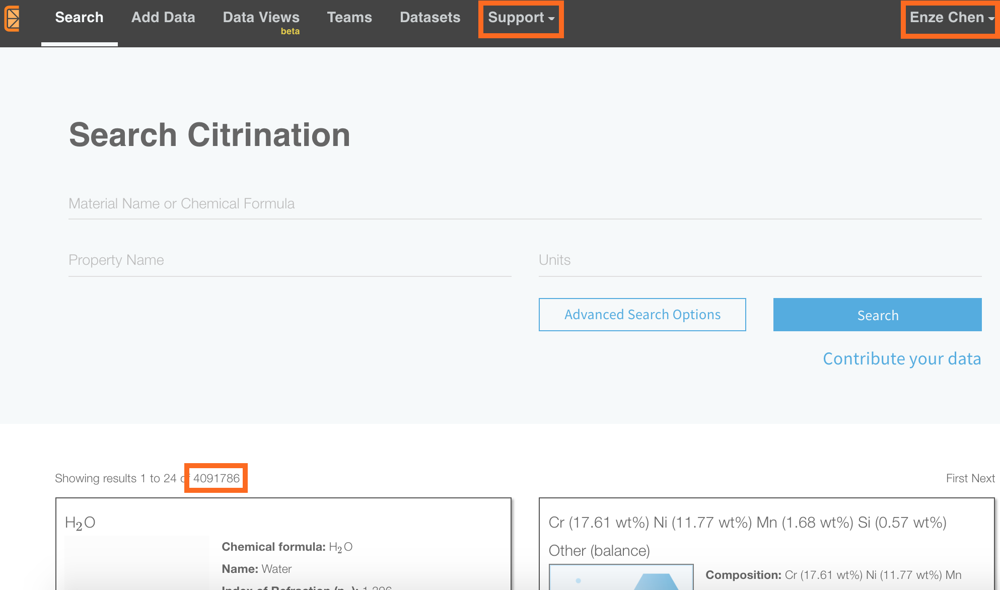
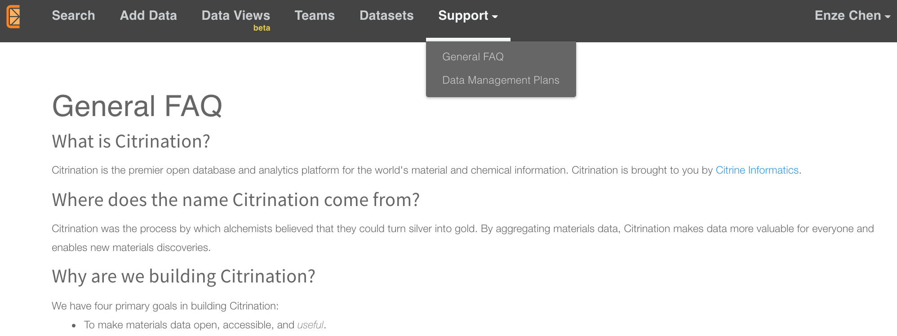
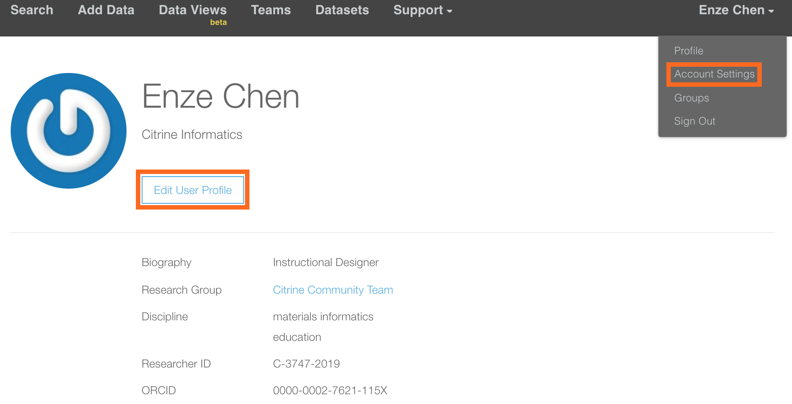

# Access and General Information
*Authors: Enze Chen*

In this guide, we will cover the login process to the [Citrination platform](https://citrination.com/) and some general information about the site.

## Learning outcomes
After reading this guide, you should feel comfortable with:
* Logging in to Citrination
* Knowing how to access account information
* Knowing where to look for help

## Login landing page
The first time you try to access the Citrination platform, you will arrive at the following landing page:    

   

As a community research member, you should click the "OPEN" link. This brings you to the login page, where you can sign in with a Google account, or use your email address. Click "Sign up" on the bottom if you would like to make a new user account.

## Main page
After logging in, you will be directed to the main page, which defaults to the [Search](04_search.md) functionality. Below the search menu you will see all of the *public* [PIF records](http://citrineinformatics.github.io/pif-documentation/index.html) on Citrination, which at the time of this writing totals nearly 4.1 million records.   

   

We will address some of the other menu options at a later time. For now, we point out the **Support** and **User** dropdown menus.

## Support
The first page on the Support menu is a list of frequently asked questions (FAQs). It explains some of the philosophy behind Citrination and how it can be applied to your research. It also lists resources and learning tools that we have developed to help you get started with using our platform.   

   

The second page on Data Management plan clarifies how the data stored on Citrination is licensed and how it should be shared. We appreciate acknowledgement when we provide data hosting services, but by no means do we require it.

## User
The User menu has four options on it. The first is your user profile, which looks like the screenshot below:   

   

Here you can add information about yourself, like a biography, your research areas, and any linked IDs by clicking "Edit User Profile."

Perhaps the most important option in the dropdown menu is the "Account Settings" option, which allows you to edit your personal account details, like your email address. It also has your **personal API Key**, which you will use for [API](http://citrineinformatics.github.io/python-citrination-client/index.html) authentication. You should never share this key with anyone or post it publicly. The third item in Account Settings is setting up [Two-Factor Authentication](https://authy.com/what-is-2fa/), which we advise but is certainly optional.

## Getting help
At the bottom, you will see a table of six blue links:   

The three links in the right column contain the standard administrative and legal fine print. The three on the left, however, deserve a little bit of elaboration:
* **Report a Bug**: As humans, we make mistakes. If you notice a bug on our platform, we would be forever grateful if you could report it.
* **Feedback**: We're a small company aspiring to do high-impact work, and we want to prioritize the most urgent needs. Let us know how we're doing and how we can best help you.
* **Join our Newsletter**: Our newsletter comes out once a week and contains the latest materials informatics academic research and business trends.

## Conclusion
This concludes our discussion of the administrivia of the Citrination platform. As mentioned earlier, you should now feel comfortable with:
* Logging in to Citrination
* Knowing how to access account information
* Knowing where to look for help

When you're ready to move on, feel free to look at either the [Data Management](02_data_management.md) or [Searching Citrination](04_search.md) guides. If you have further questions, please do not hesitate to [Contact Us](https://citrine.io/contact/).
