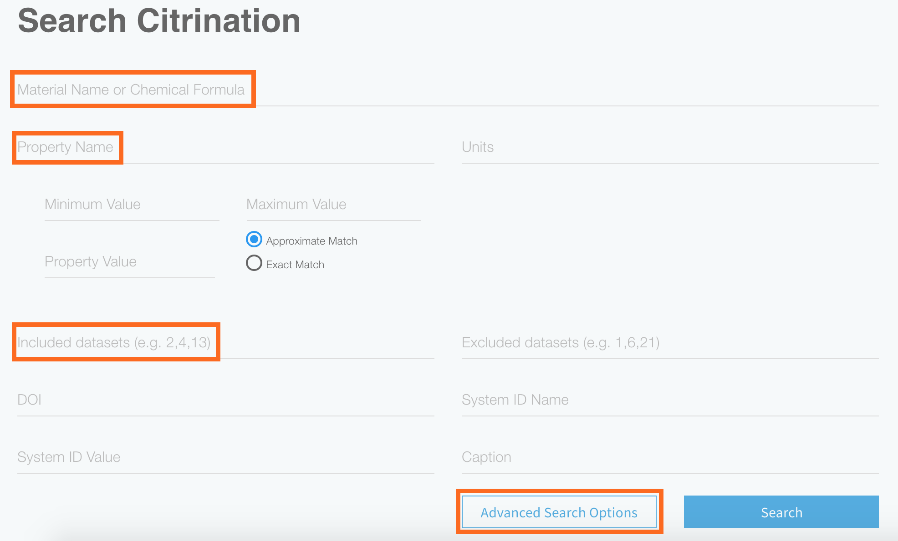

# Search
*Authors: Enze Chen*

In this guide, we will cover how to search for data on Citrination using the web UI.

## Learning outcomes
After reading this guide, you should feel comfortable:
* Searching for PIF records using the Citrination UI.

## Background knowledge
To get the most out of this guide, it is helpful to be familiar with:
* The Physical Information File (PIF) format. This is how data is stored in Citrination, and it is our recommended format for any materials data.
  * [Documentation](http://citrineinformatics.github.io/pif-documentation/schema_definition/index.html)
  * [Publication](https://www.cambridge.org/core/journals/mrs-bulletin/article/beyond-bulk-single-crystals-a-data-format-for-all-materials-structurepropertyprocessing-relationships/AADBAEDA62B0391D708CF02269989E8B)
  * [Example](https://github.com/CitrineInformatics/learn-citrination/blob/master/AdvancedPif.ipynb)
* [Datasets](02_data_management.md) on Citrination.

## Search page
The [Search page](https://citrination.com/search/simple) is the default page when accessing Citrination, and the following options appear when you click on "Advanced Search Options":

  

As you can see, there is tremendous flexibility in how search queries are constructed. With the large amount of data on our platform, this will help you narrow down your options to obtain exactly the data you need. Some important fields to note are:
* **Material Name or Chemical Formula**: This will return all PIF records that match the name or formula.
* **Property Name**: This will return all PIF records that have the specified Property. Names are *case-insensitive*, but no wildcard searches are allowed (using asterisks).
* **Included datasets**: This will only search among the records in the specified datasets.
  * If you're only searching through one dataset, you can also use the search functionality on that dataset's page.

When "Search" is pressed, any relevant records are returned at the bottom.

## Conclusion
This concludes our short discussion of how to search for data using the Citrination UI. If you have further questions, please do not hesitate to [Contact Us](https://citrine.io/contact/).
