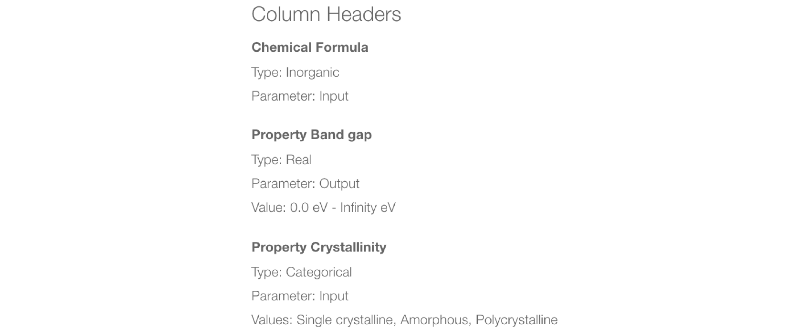
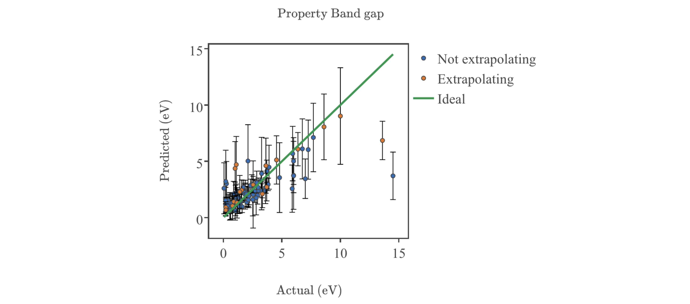
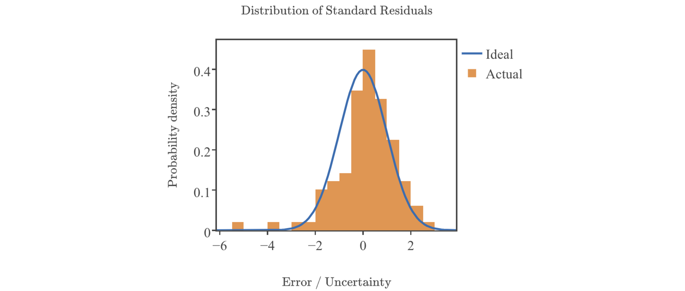

# Machine Learning
*Authors: Enze Chen*

In this guide, we will cover how to configure a machine learning (ML) model from a data view using the Citrination web UI. ML is an automated process that identifies relationships in your data between a set of inputs and a set of outputs. The Citrination platform simplifies the user experience and generates powerful ML models with informative reports for analysis. Building a ML model also enables [Prediction and Design](07_predict_design.md), which is covered in a later guide.

## Learning outcomes
After reading this guide^, you should be familiar with:
* Choosing the set of inputs and output for a ML model
* Assessing model quality through Model Reports     

^ *Note*: This guide is quite dense and will likely take many read-throughs before things start to fully click. Turns out, ML is [h](https://machinelearningmastery.com/applied-machine-learning-is-hard/)[a](https://developers.google.com/machine-learning/problem-framing/hard)[r](http://ai.stanford.edu/~zayd/why-is-machine-learning-hard.html)[d](https://www.forbes.com/sites/janakirammsv/2018/01/01/why-do-developers-find-it-hard-to-learn-machine-learning/#7d62eccf6bf6); when applied to materials science, it might be [even harder](https://youtu.be/28Ue_jteKI4?t=254).

## Background knowledge
To get the most out of this guide, it is helpful to be familiar with:
* How to create [data views](https://citrination.com/data_views/) on Citrination ([guide](03_data_view.md)).
* Basic machine learning. This is understandably vague and requires prerequisites in and of itself.
  * [This YouTube video](https://www.youtube.com/watch?v=nWk6QlwvXok), made by Julia Ling, gives an introduction to ML for materials science.
  * [This visual](http://www.r2d3.us/visual-intro-to-machine-learning-part-1/) is also a gentle introduction.

## Configure ML
You might recall in the [Data Views guide](03_data_views.md) that we deferred configuring ML services at the time—this guide picks up right where we left off. If you navigate to the view you created, and click on "Machine Learning Configuration," you will be asked to set column types for each of the properties in your view.

It is helpful to expand the description ("Show More") and read about the various parameters on this page. On the bottom of that page, each property is listed with its **Descriptor Type** (Categorical, Real, Organic, Inorganic, Alloy), **Parameter Type** (Input, Output, Latent variable, Ignore), and **Values**. If you would like to change a setting, click "edit" next to the corresponding property. You need to have at least one input and at least one output (this is the [supervised learning](https://bigdata-madesimple.com/machine-learning-explained-understanding-supervised-unsupervised-and-reinforcement-learning/) paradigm).

For this tutorial, we'll edit "Property Crystallinity" because we want it as an Input rather than an Output.

The above menu will open up, allowing you to change the Variable Type to "Input." Depending on the Descriptor Type, this menu will show different options. *Categorical* descriptors will have all the categories listed for you to include (all are included by default), while *Real* descriptors will have a range of values for you to include. When you're all done—the other properties are fine, though it's a good idea to check each one—click "Okay" to collapse the menu, and finally **Save** at the very top.

## Model training
"Training" is the term that refers to a ML model learning the relationships in the data given. Blue progress bars will display at the top of your screen indicating which step it's currently on.

Green boxes will appear at the top of the page to inform you of when certain services are ready. Some services, like Model Reports, take longer than others, like Predict services. While you're waiting, if you navigate to the **Summary** page for your view, you will see the column headers listed with their configured settings for ML. You can always return to the **Configuration** page to change the property types.

  

## Model reports
When your model has finished training, you can view the model properties and statistical summaries on the **Reports** page.

### Feature statistics

The "Data Summary" page will load by default and show two plots for each *output* property. The first plot is a bar chart of [Pearson correlation coefficient](https://www.spss-tutorials.com/pearson-correlation-coefficient/) values, which measure the linearity in the relationship between each input feature and the output variable. A value of `-1` indicates a perfectly negative linear relation, a value of `1` indicates a perfectly positive linear relation, and a value of `0` indicates no linear relation. Note, however, that [correlation does not imply causation](https://towardsdatascience.com/why-correlation-does-not-imply-causation-5b99790df07e).

You will also notice that the input we selected was "Chemical Formula," but the actual features that were generated were statistical metrics over elemental properties such as "electronegativity" and "atomic fraction." These are derived from the [Magpie](http://oqmd.org/static/analytics/magpie/doc/) library and explained in [this paper](https://www.nature.com/articles/npjcompumats201628).

The second figure on the "Data Summary" page is a **t-SNE** plot, which is short for t-Distributed Stochastic Neighbor Embedding. As you saw above, materials tend to live in *high-dimensional space*, meaning that there are tens to hundreds of features used to represent a material, and it can be very difficult to visualize and wrap our minds around 100+ dimensions. Therefore, we employ t-SNE as a *dimensionality reduction* technique to project the data onto 2 dimensions for ease of visualization, as shown below.

This technique was developed about [a decade ago](https://lvdmaaten.github.io/tsne/) ([easier explanation](https://www.analyticsvidhya.com/blog/2017/01/t-sne-implementation-r-python/)) and it's a powerful projection tool because nearby points in high dimensional space remain close in 2D while distant points remain far apart. 

### Model performance

### Performance plots

## Conclusion
Whew! This concludes our lengthy discussion of ML on Citrination. At this point, you should be familiar with:
* Choosing the set of inputs and output for a ML model
* Assessing model quality through Model Reports

With your ML model in hand, you're now equipped to perform [Prediction and Design](07_predict_design.md) services through the UI. These are core elements of [Citrine's sequential learning framework](https://citrine.io/platform/sequential-learning/) and enable you to leverage the power of materials informatics to do better research, faster. As always, if you have further questions, please do not hesitate to [Contact Us](https://citrine.io/contact/).
