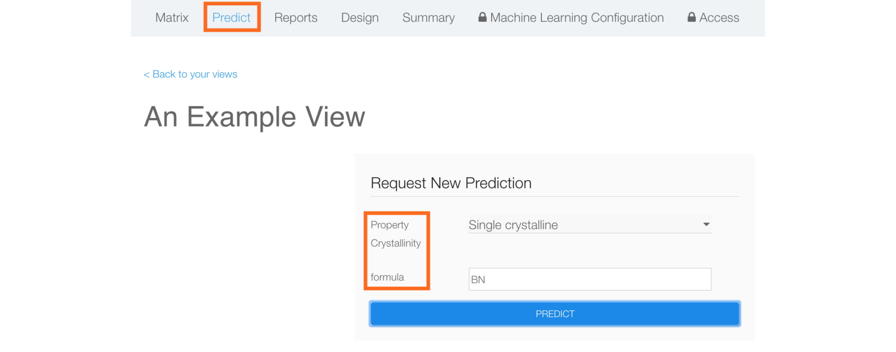
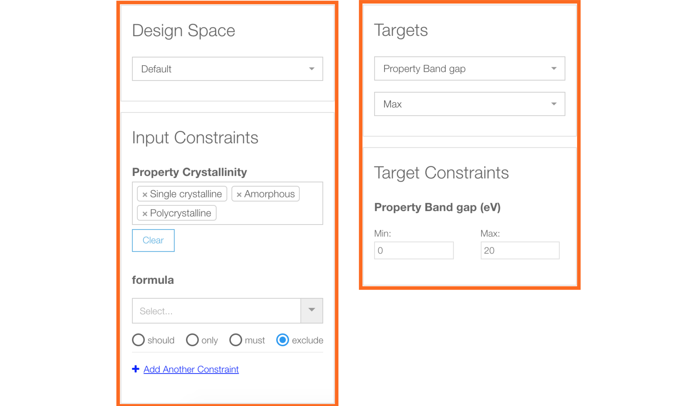
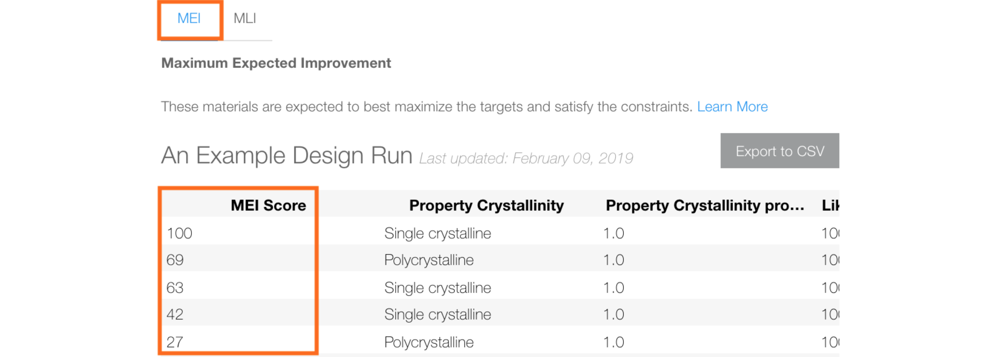
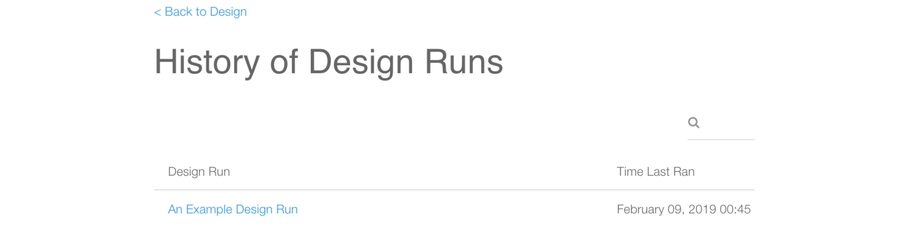

# Predict and Design
*Authors: Enze Chen*

In this document, we will cover how to use the Predict and Design interfaces on the Citrination web UI. These services are enabled once you have constructed a machine learning (ML) model and they can be accessed from the data view page.

## Learning outcomes
After reading this guide, you should feel comfortable with:
* Making predictions with the UI
* Setting design parameters with the UI
* Finding the best performing materials and the best experiments to perform next

## Background knowledge
To get the most out of this guide, it is helpful to be familiar with:
* How to train [ML models](06_machine_learning.md) on Citrination

## Predict

## Design

## Conclusion

This wraps up our discussion of the Predict and Design interfaces on the Citrination UI. At this point, you should feel comfortable with:
* Making predictions with the UI
* Setting design parameters with the UI
* Finding the best performing materials and the best experiments to perform next

If you have further questions, please do not hesitate to [Contact Us](https://citrine.io/contact/).
